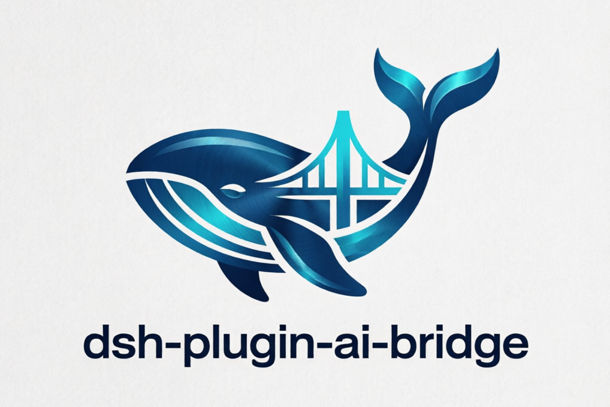

[简体中文](README.md) · [English](README.en.md) · [日本語](README.ja.md) · [**한국어**](README.ko.md)

<div align="center">



# 🌉 dsh-plugin-ai-bridge

### *DeepSeek Harness를 외부 AI 모델과 연결 —— 2차 의견 코드 리뷰 · 적대적 리뷰 · 작업 위임 · 논블로킹 백그라운드 실행*

[](LICENSE)
[](https://github.com/topics/dsh-plugin)
[](#)
[](#)
[](#)

[](#)
[](#)
[](#)
[](#)

<br>

[✨ 기능](#features) · [⚡ 설치](#install) · [🔧 설정](#config) · [🎛️ 명령어](#commands) · [🧰 도구](#tools) · [🏗️ 아키텍처](#architecture) · [🎬 데모](#demo) · [🧪 테스트](#tests) · [⚖️ 라이선스](#license)

</div>

---

<a id="features"></a>
## ✨ 기능

DeepSeek Harness에는 현재 모델 간 협업 기능이 없습니다. 이 플러그인은 그 위에 "다리"를 놓습니다 —— 세션 안에서 코드 리뷰나 복잡한 작업을 외부 모델에 위임하고, 그 판단을 현재 세션으로 다시 가져옵니다.

<table>
<tr><td align="left">

🔍 &nbsp;읽기 전용 **2차 의견 리뷰** —— 스타일·로직·잠재 버그·보안. 세션 상태는 변경하지 않음<br>
⚔️ &nbsp;**적대적 리뷰** —— 설계 결정·아키텍처 가정·경계 조건·예외 처리를 5~10개의 "영혼을 흔드는" 질문으로 공격<br>
🛟 &nbsp;**작업 위임 / 구조(rescue)** —— 대화 기록 + 작업을 묶어 결과를 플러그인 컨텍스트로 주입<br>
⏳ &nbsp;**논블로킹 백그라운드 작업** —— `ctx.jobs` 기반의 `status` / `result` / `cancel`<br>
🧩 &nbsp;**모델용 도구** —— `ai_bridge_review` / `ai_bridge_delegate`로 에이전트가 스스로 조언을 구할 수 있음

</td></tr>
</table>

| 기능 | 실행 방법 | 설명 |
|------|---------|------|
| 2차 의견 리뷰 | `/bridge review <file\|code>` | 읽기 전용 리뷰, 논블로킹 백그라운드로 실행 |
| 적대적 리뷰 | `/bridge adversarial-review <file\|code>` | 5~10개의 도전적인 질문 |
| 작업 위임 / 구조 | `/bridge rescue <task>` | 기록 + 작업 → 외부 모델 → 결과 주입 |
| 작업 상태 | `/bridge status` | bridge 백그라운드 작업 나열 |
| 결과 읽기 | `/bridge result <job-id>` | 완료된 작업 출력 읽기 |
| 작업 취소 | `/bridge cancel <job-id>` | 실행 중인 작업 취소 |

---

<a id="install"></a>
## ⚡ 설치

```sh
# 1. DSH 프로필에 추가
dsh plugin --profile <profile-name> add dsh-plugin-ai-bridge

# 2. 프로필의 cordis.patch.yml에 등록 ("설정" 참조)

# 3. 프로필을 재시작한 뒤 입력:
/bridge help
```

> 소스에서 설치하려면 `npm run build` 후 `lib/`을 프로필의 `node_modules/dsh-plugin-ai-bridge`에 링크하세요.

---

<a id="config"></a>
## 🔧 설정

플러그인 설정은 프로필의 `cordis.patch.yml`에 작성합니다(환경 변수는 폴백으로 동작).

| 키 | 기본값 | 설명 |
|---|---|---|
| `apiKey` | `''` | 외부 모델 API 키 |
| `baseUrl` | provider에 따라 자동 | 엔드포인트 기본 URL(OpenAI 호환은 `/v1` 포함, Anthropic은 미포함) |
| `provider` | `openai` | `openai`(GPT, Chat Completions) · `codex`(Responses API) · `anthropic`(Claude) · `generic`(임의의 OpenAI 호환 릴레이) |
| `defaultModel` | `gpt-5-codex` | 기본 모델 id |
| `timeoutMs` | `120000` | 요청당 타임아웃(밀리초) |
| `maxOutputTokens` | `4000` | 호출당 최대 출력 토큰 |

<details>
<summary><b>🔵 예시 1: GPT(Chat Completions)</b></summary>

```yaml
# $DSH_HOME/profiles/<profile-name>/cordis.patch.yml
- insert:
    - id: ai-bridge
      name: dsh-plugin-ai-bridge
      config:
        provider: openai
        defaultModel: gpt-5-codex
        baseUrl: https://api.openai.com/v1
        apiKey: sk-...
```
</details>

<details>
<summary><b>⚫ 예시 2: Codex(Responses API)</b></summary>

```yaml
- insert:
    - id: ai-bridge
      name: dsh-plugin-ai-bridge
      config:
        provider: codex
        defaultModel: gpt-5-codex
        baseUrl: https://api.openai.com/v1
        apiKey: sk-...
```
</details>

<details>
<summary><b>🟤 예시 3: Claude(Anthropic)</b></summary>

```yaml
- insert:
    - id: ai-bridge
      name: dsh-plugin-ai-bridge
      config:
        provider: anthropic
        defaultModel: claude-sonnet-4-5
        baseUrl: https://api.anthropic.com
        apiKey: sk-ant-...
```
</details>

<details>
<summary><b>🟣 예시 4: 커스텀 OpenAI 호환 게이트웨이</b></summary>

```yaml
- insert:
    - id: ai-bridge
      name: dsh-plugin-ai-bridge
      config:
        provider: generic
        baseUrl: https://your-gateway.example.com/v1
        defaultModel: your-model-id
        apiKey: ...
```
</details>

### 🔌 릴레이 게이트웨이(cc-switch)

플러그인은 `baseUrl`을 통해 임의의 릴레이 서비스를 지원합니다. [cc-switch](https://github.com/farion1231/cc-switch)로 Claude / Codex를 릴레이에 연결했다면, 동일한 "릴레이 URL + 토큰 + 모델명"을 그대로 적으면 됩니다:

| 시나리오 | `provider` | `baseUrl` | `defaultModel` |
|----------|-----------|-----------|----------------|
| Codex(Chat Completions 릴레이) | `generic` | `https://<릴레이>/v1` | 릴레이가 요구하는 모델명 |
| Codex(Responses API 릴레이) | `codex` | `https://<릴레이>/v1` | 릴레이가 요구하는 모델명 |
| Claude(Anthropic 릴레이) | `anthropic` | `https://<릴레이>` | 릴레이가 요구하는 모델명 |

> ⚠️ cc-switch는 Claude Code / Codex CLI 각각의 설정 파일에 기록하므로 DSH 프로세스에 자동으로 주입되지 않습니다. 위 설정에 동일한 릴레이 자격 증명을 다시 적거나, cc-switch 스타일 환경 변수(아래)를 내보내면 플러그인이 폴백으로 읽습니다.

### 🔑 환경 변수 폴백

`cordis.patch.yml`에 값이 없으면 다음 우선순위로 환경 변수에서 읽습니다:

- **API 키**: `BRIDGE_API_KEY` → `ANTHROPIC_AUTH_TOKEN`(anthropic 전용) → `ANTHROPIC_API_KEY`(anthropic 전용) → `OPENAI_API_KEY`
- **baseUrl**: `BRIDGE_BASE_URL` → `ANTHROPIC_BASE_URL`(anthropic 전용) / `OPENAI_BASE_URL`(기타)
- **모델**: `BRIDGE_MODEL`

> 따라서 셸에 cc-switch에서 흔히 쓰는 `ANTHROPIC_BASE_URL` / `ANTHROPIC_AUTH_TOKEN` / `OPENAI_BASE_URL` / `OPENAI_API_KEY`를 이미 내보냈다면, 이 플러그인이 그대로 재사용합니다.

---

<a id="commands"></a>
## 🎛️ 명령어

> DSH 명령어 이름은 `[a-z][a-z0-9_-]*`만 허용됩니다(`:` 불가). 따라서 6개 작업은 단일 `/bridge` 명령어의 **하위 명령**으로 구현했습니다:

| 요구된 명령어 | 실제 실행 방법 |
|---|---|
| `/bridge:review [파일 경로 또는 코드 조각]` | `/bridge review <file\|code>` |
| `/bridge:adversarial-review [...]` | `/bridge adversarial-review <file\|code>` |
| `/bridge:rescue [작업 설명]` | `/bridge rescue <task>` |
| `/bridge:status` | `/bridge status` |
| `/bridge:result [job-id]` | `/bridge result <job-id>` |
| `/bridge:cancel [job-id]` | `/bridge cancel <job-id>` |

### 🔍 `/bridge review <file|code>`

읽기 전용 리뷰. `file`은 절대 경로 또는 현재 세션 작업 디렉터리 기준의 상대 경로를 지정할 수 있으며, 그 외의 입력은 코드 조각으로 처리됩니다.

```
/bridge review src/index.ts
/bridge review function add(a, b) { return a - b }
```

`review`와 `adversarial-review`는 **백그라운드 작업**으로 실행되며(논블로킹), 즉시 `ai-bridge-N` 작업 id를 반환합니다. 결과는 `/bridge result <id>`로 읽습니다.

### ⚔️ `/bridge adversarial-review <file|code>`

적대적 리뷰. 5~10개의 "영혼을 흔드는" 질문을 출력합니다.

### 🛟 `/bridge rescue <task>`

작업 + 현재 대화 기록(최근 200개 메시지, 최대 60k 문자, 도구 호출/결과 포함)을 묶어 외부 모델에 위임합니다. 완료되면 결과가 `[bridge rescue result]` 접두사의 플러그인 컨텍스트로 세션에 자동 주입되며, `/bridge result <id>`로도 읽을 수 있습니다.

### ⏳ 작업 관리

```
/bridge status             # bridge 백그라운드 작업 나열
/bridge result <job-id>    # 완료된 결과 읽기(실행 중이면 대기 안내)
/bridge cancel <job-id>    # 실행 중 작업 취소
```

---

<a id="tools"></a>
## 🧰 모델용 도구

플러그인은 DeepSeek Harness 에이전트가 사람의 입력 없이도 능동적으로 사용할 수 있도록 두 개의 도구도 등록합니다:

| 도구 | 파라미터 | 설명 |
|------|------|------|
| `ai_bridge_review` | `code`(필수) · `adversarial?` | 코드(또는 파일 경로)를 외부 모델에 보내 읽기 전용 리뷰 |
| `ai_bridge_delegate` | `task`(필수) · `include_history?` | 작업을 위임(선택적으로 대화 기록 포함)하고 그 연속을 반환 |

---

<a id="architecture"></a>
## 🏗️ 아키텍처

의존성 주입: `inject = ['commands', 'jobs', 'tools']`; `apply()`에서 `ctx.jobs.attachController('ai-bridge')`로 백그라운드 작업 컨트롤러를 연결합니다.

| 파일 | 역할 |
|------|------|
| `src/index.ts` | 플러그인 진입점: `name` / `inject` / `Config` / `apply` |
| `src/client.ts` | 외부 모델 HTTP 클라이언트(OpenAI 호환 + Anthropic, 스트리밍/비스트리밍) |
| `src/prompts.ts` | review / adversarial / rescue 시스템 프롬프트 |
| `src/context.ts` | 파일 읽기와 대화 기록 직렬화 |
| `src/jobs.ts` | `ctx.jobs` 백그라운드 작업 + `JobKindMap` 확장(`ai-bridge`) |
| `src/commands.ts` | `/bridge` 명령어 등록과 하위 명령 분배 |
| `src/tools.ts` | 모델용 도구 등록 |

```
src/
├── index.ts     # 진입점: name / inject / Config / apply
├── client.ts    # 외부 모델 클라이언트(OpenAI-compatible + Anthropic)
├── prompts.ts   # 세 가지 시스템 프롬프트
├── context.ts   # 파일 읽기 + 기록 직렬화
├── jobs.ts      # ctx.jobs 백그라운드 작업 + JobKind 확장
├── commands.ts  # /bridge 명령어 분배
└── tools.ts     # ai_bridge_review / ai_bridge_delegate
```

---

<a id="demo"></a>
## 🎬 데모

```
User ❯ /bridge review src/index.ts

Bridge ❯ Started review as background job ai-bridge-1.
         Check progress: /bridge status
         Get result:     /bridge result ai-bridge-1

User ❯ /bridge status

Bridge ❯ ai-bridge-1 [ai-bridge] running — bridge review src/index.ts

User ❯ /bridge result ai-bridge-1

Bridge ❯ [스타일] 네이밍은 명확하지만 index.ts:42의 매직 넘버는 상수로 추출 권장
         [로직] parseArgs가 빈 입력에서 단락 처리되지 않아 널 참조 위험
         [보안] 사용자 입력이 템플릿 문자열에 직접 이어붙여짐 — 이스케이프 필요
         ...

User ❯ /bridge rescue 실패한 테스트를 고쳐줘

Bridge ❯ Delegated rescue task as background job ai-bridge-2.
         The result will be injected back into this session when ready.

Bridge ❯ [bridge rescue result]
         원인을 찾았습니다: ……다음 순서로 수정하세요……
```

> [`terminalizer`](https://github.com/faressoft/terminalizer) 또는 [`asciinema`](https://asciinema.org)로 `demo.gif`로 녹화할 수 있습니다.

---

<a id="tests"></a>
## 🧪 테스트

```sh
npm install        # 의존성 설치
npm run typecheck  # 타입 검사
npm run build      # lib/로 컴파일
npm test           # 빌드 후 테스트 실행
```

| 테스트 파일 | 커버리지 |
|---------|------|
| `test/client.test.mjs` | 로컬 mock 서버에 대한 API 클라이언트(OpenAI/Anthropic, 스트리밍/비스트리밍, 오류 처리) |
| `test/context.test.mjs` | 파일 읽기와 기록 직렬화 |
| `test/commands.test.mjs` | 6개 하위 명령의 엔드투엔드 동작(백그라운드 작업, rescue 주입) |
| `test/integration.test.mjs` | **실제 `CommandRuntime`**으로 플러그인을 로드하고 `/bridge` 실행 |
| `test/smoke.test.mjs` | 플러그인 객체 형태와 등록 검증 |

---

<a id="license"></a>
## ⚖️ 라이선스 및 컴플라이언스

> **이 플러그인은 OpenAI의 `codex-plugin-cc`에서 영감을 받은 독립 구현이며, OpenAI와 무관합니다.**
>
> `codex-plugin-cc`(Copyright OpenAI and its contributors)는 [Apache-2.0](https://www.apache.org/licenses/LICENSE-2.0) 라이선스입니다. 이 플러그인은 그 설계 아이디어만 참고한 독립 구현으로, 소스 코드를 포함·복제·파생하지 않았으며 OpenAI와의 제휴·보증·후원 관계가 없습니다.
>
> 관련 고지는 리포지토리 루트의 [`NOTICE`](./NOTICE)에도 기록되어 있습니다.

## 📄 라이선스

[Apache-2.0](./LICENSE) · 제3자 고지는 [`NOTICE`](./NOTICE)를 참조.

---

<div align="center">

Made with 🧡 for the [DeepSeek Harness](https://github.com/deepseek-ai/deepseek-harness) community · Inspired by OpenAI `codex-plugin-cc` (independent implementation)

</div>
